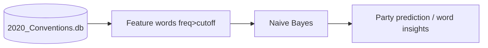
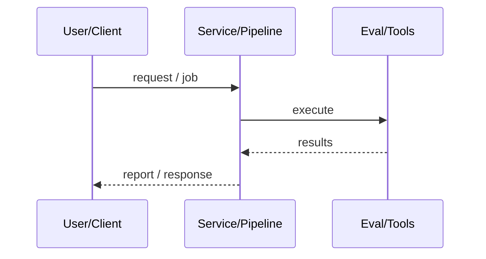
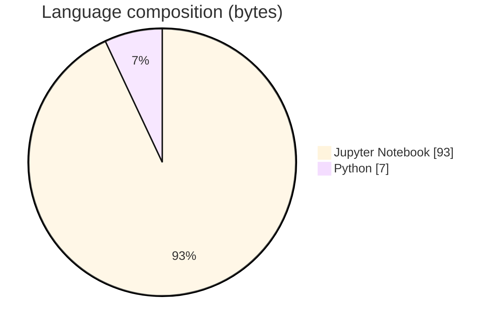

# Political Leaning Detection with Naive Bayes

### Naive Bayes on 2020 convention speech text to explore partisan language.

[](https://github.com/ArchanaChetan07/NLP-for-Political-Leaning-Detection)
[](https://github.com/ArchanaChetan07/NLP-for-Political-Leaning-Detection)
[](https://github.com/ArchanaChetan07/NLP-for-Political-Leaning-Detection)
[](https://github.com/ArchanaChetan07/NLP-for-Political-Leaning-Detection/actions)

---

## Overview

Identify word features that distinguish Democratic vs Republican convention speeches.

Module 4-Political Naive Bayes.ipynb connects to a SQLite conventions DB, builds binary feature dicts for words above a frequency cutoff, and trains exploratory Naive Bayes with train/test split.

Coursework NLP notebook demonstrating classical text classification for political leaning.

This repository is maintained as **production-minded portfolio work**: clear architecture, automated checks where present, and metrics that are **traceable to committed artifacts** (never invented).

---

## Architecture

SQLite conventions → filter Democratic/Republican text → frequency filter features → Naive Bayes train/eval → inspect distinctive words.





---

## Results & repository facts

> Only values found in code, configs, tests, or generated reports are listed. Absence of a clinical/ML accuracy number means it was **not** published in-repo.

| Metric | Value | Source |
|---|---|---|
| Tracked repository files | **5** | `git tree` |
| Default word_cutoff | **5** | `Module 4-Political Naive Bayes.ipynb` |
| Tracked files | **5** | `git tree` |
| Python modules | **1** | `git tree` |
| Test-related paths | **1** | `git tree` |
| CI workflows | **Yes** | `.github/workflows` |
| Docker present | **No** | `repo root` |



---

## Key features

- Exploratory NB on Republican vs Democratic speeches
- Frequency cutoff feature selection
- Train/test evaluation path in notebook

---

## Tech stack

| Layer | Technology |
|---|---|
| nlp | NLTK |
| ml | Naive Bayes |
| data | SQLite conventions corpus |
| ci | GitHub Actions |

---

## Skills demonstrated

Jupyter Notebook · N · L · T · K · , ·   · CI/CD · testing · automation

Keyword surface: **Python · Jupyter Notebook · machine-learning · CI/CD · testing · API · Docker · automation · data-science · software-engineering · system-design · observability · LLM · cloud**

---

## Project structure

```text
NLP-for-Political-Leaning-Detection/
├── Module 4-Political Naive Bayes.ipynb
├── requirements.txt
├── tests/test_nlp_for_political_leaning.py
└── .github/workflows/ci.yml
```

---

## Installation & usage

```bash
git clone https://github.com/ArchanaChetan07/NLP-for-Political-Leaning-Detection.git
cd NLP-for-Political-Leaning-Detection
pip install -r requirements.txt
jupyter notebook "Module 4-Political Naive Bayes.ipynb"
```

---

## How it works

Notebook expects a local SQLite path to convention speeches, builds binary presence features for frequent tokens, and fits Naive Bayes to study party-associated language. Feature count depends on the local DB (printed at runtime).

---

## Future improvements

- Ship anonymized sample DB or download script
- Record held-out accuracy in a metrics file

---

## License

See repository.

---

<p align="center">
  <b>Political Leaning Detection with Naive Bayes</b><br/>
  <a href="https://github.com/ArchanaChetan07/NLP-for-Political-Leaning-Detection">github.com/ArchanaChetan07/NLP-for-Political-Leaning-Detection</a>
</p>
